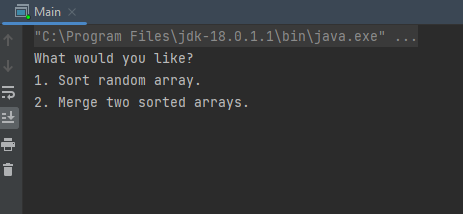
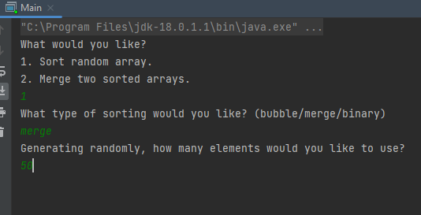
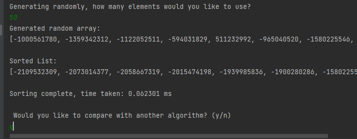
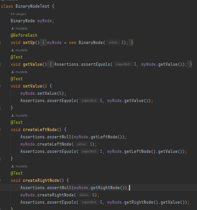
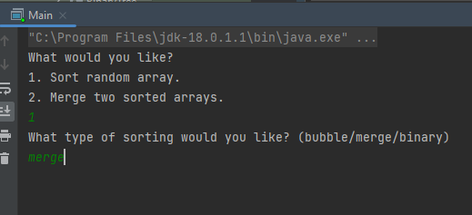
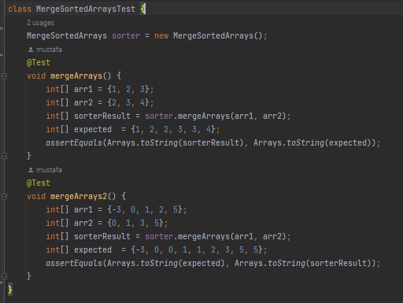

# Sort Manager

## Installation:
- Clone repo and install Mavern dependencies

## Usage:
#### This is a sort manager which contains four sorting algorithms. 
#### The model view controller (MVC) concept has been used to create the structure of the application.
##### You can choose to sort random arrays using binary sort, bubble sort, or merge sort.
##### You can also merge two randomly generated sorted arrays if you select 2 in the main menu.
An adapter class was used to create methods for converting arrays into binary trees and binary trees to arrays, 
there is also an option to sort a given array which automatically generates a new binary tree.

You should be greeted by a user interface like this:

- Choose sorting method: ****
- Chose number of elements to include in the unsorted array: 
- Choose to compare with another algorithm: 
- View the result: 

Sorting algorithm example test cases:

Binary node tests:

There are also tests available for other sorting algorithms and the binary tree.

Some custom exceptions are also thrown such as NotNaturalException